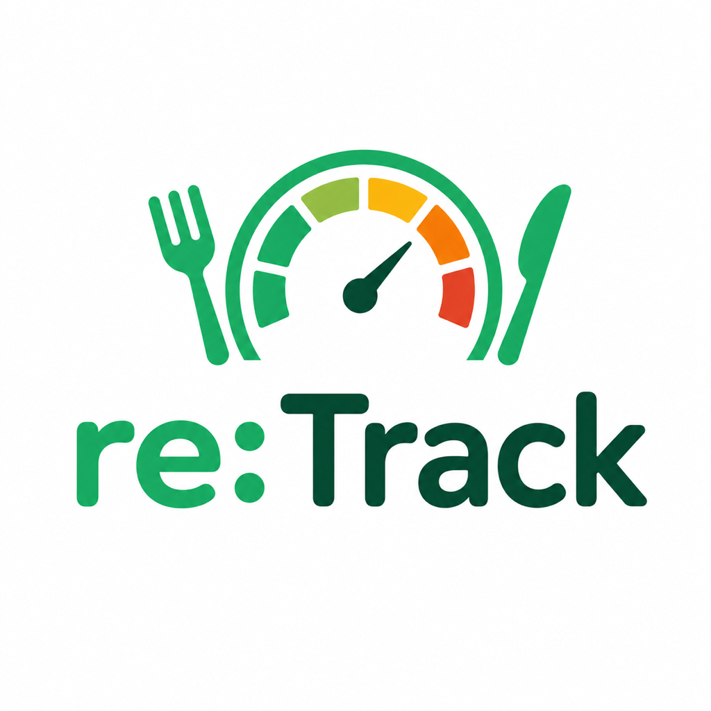

# cal:Track



A native iOS calorie and meal tracker — barcode scanning, on-device nutrition-label photo scanning, TDEE-based calorie budgeting, configurable meal slots, calorie cycling, BMI/weight tracking, and a Home Screen/Lock Screen widget. All data stays on-device.

## Features

- **Onboarding** — sex, birth date, height/weight (in kg/lb/stone and cm/ft-in, your choice), activity level, and goal, used to compute a Mifflin-St Jeor TDEE and macro targets.
- **Meal logging** — configurable meal slots (defaults to Breakfast/Snack/Lunch/Snack/Dinner/Snack), each with:
  - **Barcode scanning** via VisionKit `DataScannerViewController`, backed by the [Open Food Facts](https://world.openfoodfacts.org) API and cached on-device after first lookup.
  - **Nutrition label photo scanning** — Vision OCR + Apple's on-device Foundation Models framework structurally extract a UK/EU-style nutrition table from a photo, with an editable review screen before anything is saved (never auto-saves).
  - **Search by name** against Open Food Facts, with calories/serving shown per result and retry logic for the endpoint's occasional flakiness.
  - **Recent foods** for one-tap re-logging of anything you've logged before.
  - **Manual entry** and **editing** an already-logged entry (quantity edits are in-place; nutrition edits detach a private copy so they never retroactively change what you logged on other days).
- **Dashboard** — calorie ring, macro breakdown, today's meals, with a floating Liquid Glass quick-add button.
  - **Date navigation** — a Mon–Sun week strip (each day showing a progress ring glyph) plus a month calendar sheet for jumping further back or forward.
  - **Today shortcut** — tapping the already-active "Today" tab pops any pushed meal detail and then jumps back to today's date, mirroring the standard iOS re-tap-current-tab idiom; the dashboard also snaps back to today on its own the first time it's opened on a new calendar day.
- **Calorie cycling** — set higher-calorie days (e.g. Friday/Saturday); every other day automatically absorbs the opposite delta so the weekly total (and macros) stay unchanged.
- **Water & fasting** — both optional, per-profile: a Dashboard water card where one tap logs a glass (target, glass size and ml/fl oz set in Settings), and a fasting timer whose clock keeps running while the app is closed, with an editable start time for when you remember to start it late.
- **Trends tab** — weekly calorie and macro summary cards (Mon–Sun, with back/forward navigation), weight and calorie history charts, a weekly insights card (days on/over target, average % of target, weight trend), and:
  - **BMI tracking** — current BMI, category, trend chart, and a target BMI/weight aimed at the midpoint of the normal range.
  - **Weight tracking** — matching styling to the BMI screen, gauge scaled to this person's height.
- **Widget** — Home Screen (small/medium) and Lock Screen (circular/rectangular) calorie widgets, bridged to the app via an App Group snapshot.
- **Liquid Glass design**, brand color palette pulled from the app icon, VoiceOver labels and Dynamic Type support on custom controls.

## Requirements

- Xcode 26+, iOS 26+ deployment target.
- [XcodeGen](https://github.com/yonaskolb/XcodeGen) (`brew install xcodegen`) — the `.xcodeproj` is generated from `project.yml` and is not checked in.
- A physical iPhone for anything camera-based (barcode/label scanning) or widget-based — Simulator can't drive the camera and doesn't reliably render/refresh widgets. Nutrition label scanning additionally requires a device with Apple Intelligence support.
- Your own Apple Developer Team ID in `project.yml` (`DEVELOPMENT_TEAM`) to build and run on a device — the one currently checked in is the author's.

## Building

```bash
xcodegen generate
open MealTracker.xcodeproj
```

Or from the command line:

```bash
xcodegen generate
xcodebuild -project MealTracker.xcodeproj -scheme MealTracker -destination 'generic/platform=iOS Simulator' build
```

Run `xcodegen generate` again any time `project.yml` changes — it fully regenerates the `.xcodeproj`, so don't hand-edit project settings in Xcode without also reflecting them in `project.yml` or they'll be lost on the next regeneration.

## Testing

```bash
xcodebuild -project MealTracker.xcodeproj -scheme MealTracker -destination 'platform=iOS Simulator,name=iPhone 17' test
```

124 tests across 21 suites, covering every pure calculator (TDEE, BMI, calorie cycling, unit conversion, insights, day progress, water intake, fasting timer), the Open Food Facts DTO mapping, and the SwiftUI view models (including the weekly Trends cards). Camera, OCR/Foundation Models, and widget behavior aren't covered by the test suite and need manual on-device verification.

## Architecture

Feature-first, with a shared `Core` layer that has no dependency on `Features/`:

```
MealTracker/
  App/            @main entry point, root view, tab view
  Core/
    Persistence/  SwiftData models + schema
    Networking/   Open Food Facts client, DTOs, mapper
    Calculators/  Pure, unit-tested math (TDEE, BMI, calorie cycling, units, insights)
    UI/           Reusable unit-aware input components
    Shared/       Types shared with the widget extension
  Features/
    Onboarding/
    Dashboard/
    FoodLogging/  Add/edit/search/recent food flows
    BarcodeScan/
    LabelScan/    Camera capture, Vision OCR, Foundation Models extraction
    Charts/       Trends, BMI, weight
    Settings/
MealTrackerWidget/  WidgetKit extension (Home Screen + Lock Screen)
MealTrackerTests/
```

SwiftData persists profile inputs only — TDEE, calorie targets, and macros are always recomputed from those inputs, never stored, so the formulas can change without a migration.

## Known limitations

- **On-device only.** No iCloud sync or Sign in with Apple yet — data doesn't move between devices.
- **No HealthKit.** It was integrated at one point, but HealthKit requires a paid Apple Developer Program membership to use on a physical device, which this project doesn't have. It was removed rather than ship a permission prompt that can never succeed.
- **No watchOS companion.**
- **Open Food Facts search** occasionally returns HTTP 503 from OFF's own infrastructure; the client retries automatically, but on a bad day search may still fail after all attempts.
